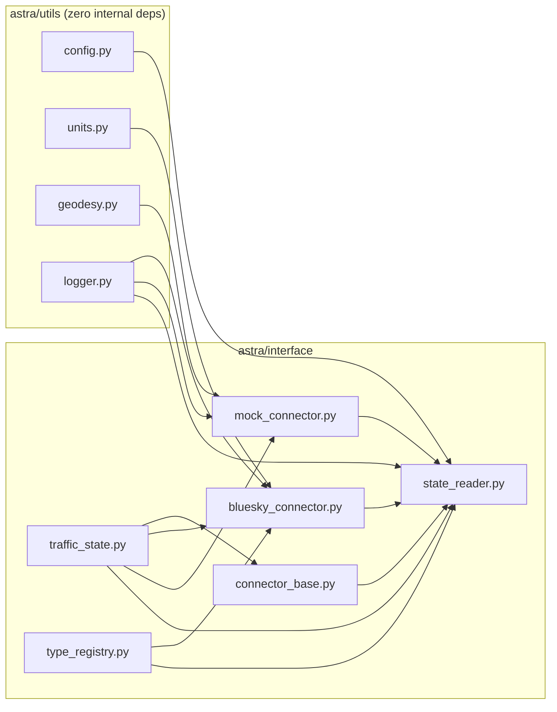
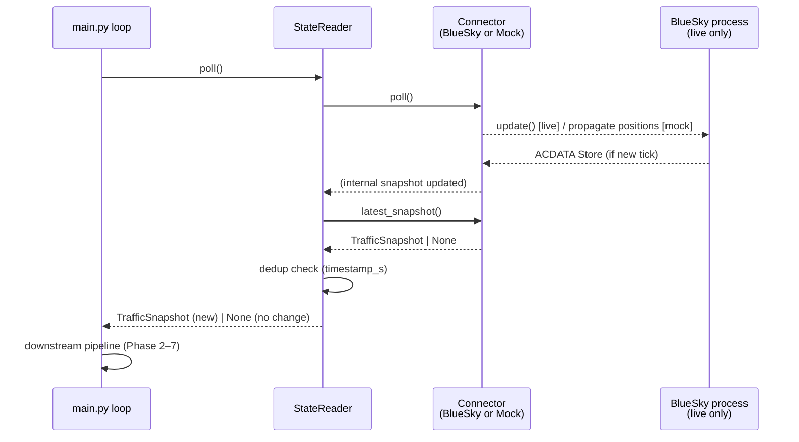

# ASTRA Prototype — System Architecture

## 1. High-Level Data Flow


---

## 2. Package Dependency Graph



Rules enforced in CI (V3):
- `utils` never imports from `interface` or any later phase.
- `bluesky` is imported **only** in `bluesky_connector.py`.
- No circular imports (verified by DFS).

---

## 3. Poll-Cycle Sequence



---

## 4. ConnectorProtocol

Both concrete connectors satisfy this Protocol via **structural subtyping**
(no explicit inheritance — avoids MRO collision with BlueSky's `Client`):

```
ConnectorProtocol
├── connect()                     → None
├── poll()                        → None
├── latest_snapshot()             → Optional[TrafficSnapshot]
├── has_active_node()             → bool
├── send_command(text: str)       → None
└── create_aircraft(cs,type,lat,lon,hdg,alt,spd) → None
```

---

## 5. Unit Conventions

| Domain       | Unit used throughout ASTRA | BlueSky internal | Conversion |
|---|---|---|---|
| Altitude     | feet (ft)                  | metres (m)       | `meters_to_feet()` |
| Ground speed | knots (kt)                 | m/s              | `mps_to_knots()` |
| Vertical speed | feet/minute (fpm)        | m/s              | `mps_to_fpm()` |
| Distance     | nautical miles (NM)        | metres (m)       | `nm_to_meters()` |
| Heading      | degrees true               | degrees true     | (unchanged) |
| Position     | decimal degrees WGS-84     | decimal degrees  | (unchanged) |
| Time         | simulation seconds (simt)  | simulation seconds | (unchanged) |

All conversions happen **once**, at the `_on_acdata()` boundary in
`bluesky_connector.py`. Every module above that layer works exclusively in
ATM units.
