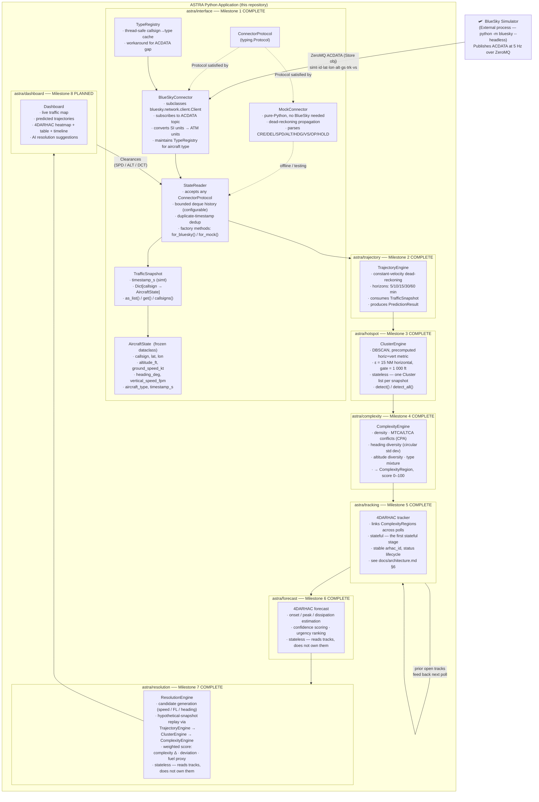
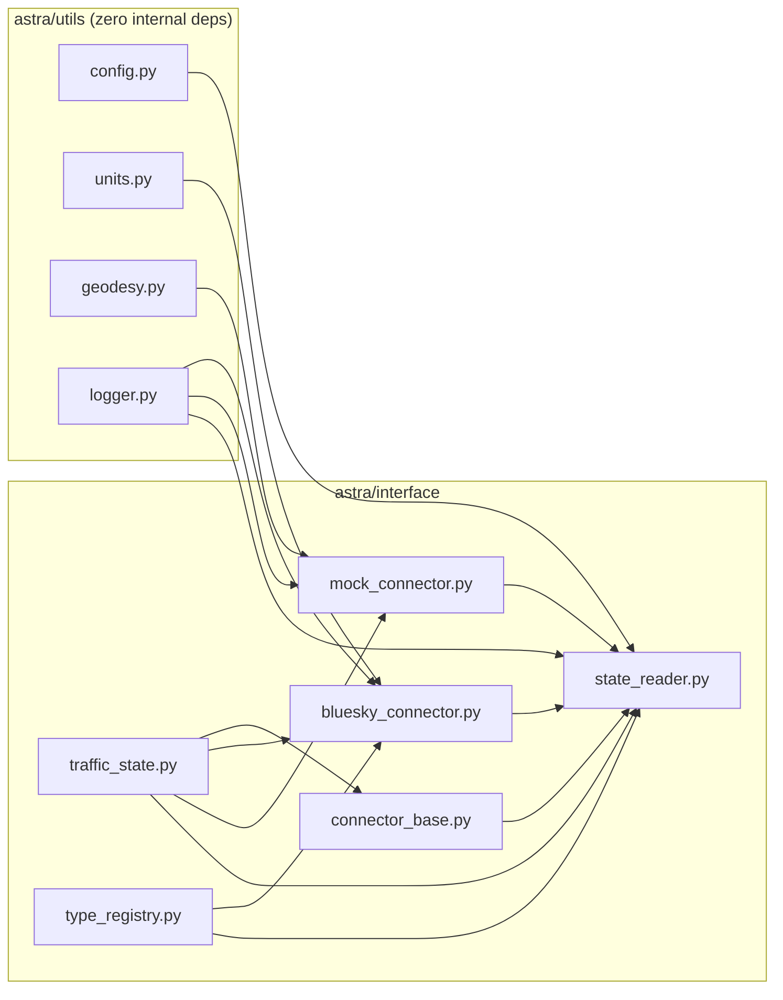
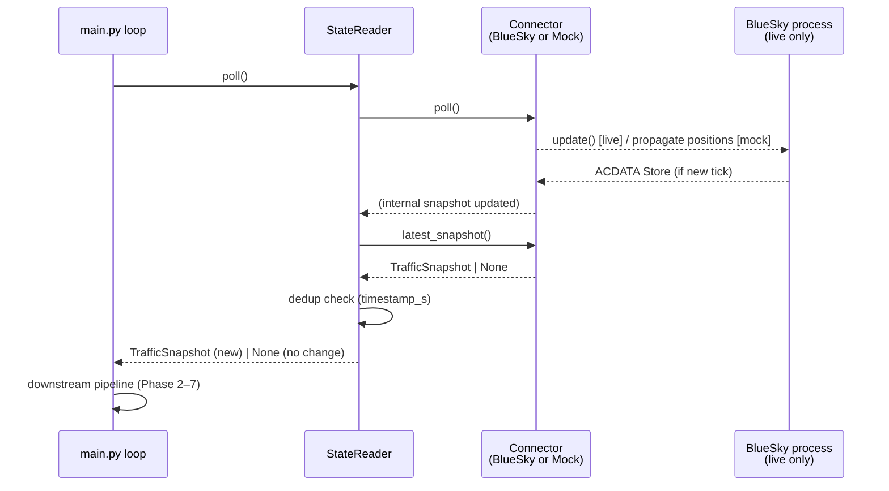
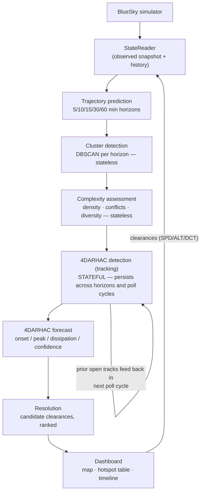

# ASTRA Prototype — System Architecture

## 1. High-Level Data Flow



---

## 2. Package Dependency Graph



Design rules (no CI pipeline exists in this repo; verified manually):
- `utils` never imports from `interface` or any later phase.
- `bluesky` is imported **only** in `bluesky_connector.py`.
- No circular imports.

---

## 3. Poll-Cycle Sequence



---

## 4. ConnectorProtocol

Both concrete connectors satisfy this Protocol via **structural subtyping**
(no explicit inheritance — avoids MRO collision with BlueSky's `Client`):

```
ConnectorProtocol
├── connect()                     → None
├── poll()                        → None
├── latest_snapshot()             → Optional[TrafficSnapshot]
├── has_active_node()             → bool
├── send_command(text: str)       → None
└── create_aircraft(cs,type,lat,lon,hdg,alt,spd) → None
```

---

## 5. Unit Conventions

| Domain       | Unit used throughout ASTRA | BlueSky internal | Conversion |
|---|---|---|---|
| Altitude     | feet (ft)                  | metres (m)       | `meters_to_feet()` |
| Ground speed | knots (kt)                 | m/s              | `mps_to_knots()` |
| Vertical speed | feet/minute (fpm)        | m/s              | `mps_to_fpm()` |
| Distance     | nautical miles (NM)        | metres (m)       | `nm_to_meters()` |
| Heading      | degrees true               | degrees true     | (unchanged) |
| Position     | decimal degrees WGS-84     | decimal degrees  | (unchanged) |
| Time         | simulation seconds (simt)  | simulation seconds | (unchanged) |

All conversions happen **once**, at the `_on_acdata()` boundary in
`bluesky_connector.py`. Every module above that layer works exclusively in
ATM units.

---

## 6. 4DARHAC Domain Model and Revised Pipeline

> **Status:** design decision recorded by the July 2026 architecture
> review. `Cluster` (Milestone 3), `ComplexityRegion` (Milestone 4),
> `FourDArhac` (Milestone 5), and `ForecastEngine` (Milestone 6) are all
> implemented — see `docs/milestone_3_hotspot.md`,
> `docs/milestone_4_complexity.md`, `docs/milestone_5_tracking.md`, and
> `docs/milestone_6_forecast.md` for their as-built details.
> `docs/milestone_6_forecast_design_review.md` is retained as the
> original, since-approved design review.

### 6.1 Why the old Phase 3 ("hotspot detection") was under-specified

`astra/hotspot`'s original docstring bundled two operations that have
different natures under one component:

- **Spatial clustering** (DBSCAN over one snapshot) — stateless, pure.
- **Temporal linkage** ("is this cluster the same physical area I saw at
  the last horizon, or the last poll cycle?") — stateful, an association/
  tracking problem, with no owner anywhere in the original design despite
  being name-checked as a bullet ("cluster tracking across time steps").

A 4D Area of Relatively High ATC Complexity (4DARHAC) is, by definition, a
region that persists and evolves through time — not an independent 3D
snapshot recomputed from scratch every horizon and every poll cycle. The
model below makes the identity/tracking problem an explicit, first-class
component instead of an implicit assumption.

### 6.2 Domain model

```python
@dataclass(frozen=True)
class Cluster:
    """Purely spatial grouping at one instant. Stateless, ephemeral —
    identity is only meaningful within a single detection pass.
    IMPLEMENTED as astra.hotspot.models.Cluster (Milestone 3)."""
    cluster_id: str                  # ephemeral, e.g. f"{source}:{horizon_min}:{dbscan_label}"
    source: Literal["observed", "predicted"]
    horizon_min: int                 # 0 = observed/current, else 5/10/15/30/60
    valid_at_s: float                 # ABSOLUTE sim time (timestamp_s + horizon_min*60)
    member_callsigns: FrozenSet[str]
    centroid_lat: float               # as-built: 3 scalar fields, not a tuple
    centroid_lon: float
    centroid_alt_ft: float
    horizontal_extent_nm: float


@dataclass(frozen=True)
class ComplexityRegion:
    """A Cluster plus its instantaneous complexity assessment.
    Still stateless / per-instant — composition, not inheritance.
    IMPLEMENTED as astra.complexity.models.ComplexityRegion (Milestone 4)."""
    cluster: Cluster
    complexity_score: float           # 0-100
    components: dict[str, float]      # density, mtca_count, ltca_count,
                                       # heading_div_deg, alt_div_ft, type_mix_count
    computed_at_s: float


@dataclass
class FourDArhac:
    """The persistent 4D object. Mutable / stateful — survives across
    horizons AND across poll cycles. IMPLEMENTED as
    astra.tracking.models.FourDArhac; identity/status fields owned by
    TrackerEngine (Milestone 5), forecast fields owned by ForecastEngine
    (Milestone 6, see §6.6)."""
    arhac_id: str                     # stable UUID, assigned at first detection
    status: Literal["CANDIDATE", "CONFIRMED", "GROWING",
                     "PEAK", "DISSIPATING", "CLOSED"]
    track: list[ComplexityRegion]     # ordered by valid_at_s
    member_aircraft: FrozenSet[str]   # union of callsigns across the track
    first_detected_cycle_s: float
    predicted_onset_s: float | None           # set by ForecastEngine (M6)
    peak_complexity: float                    # observed-or-predicted max (M6 may raise it)
    peak_time_s: float | None
    predicted_dissipation_s: float | None     # set by ForecastEngine (M6)
    predicted_peak_time_s: float | None       # set by ForecastEngine (M6) — added, §6.6 OQ-2
    confidence: float                 # 0-1, can strengthen across repeated cycles
    priority: int                     # FMP triage ranking (severity only, TrackerEngine)
    forecast_urgency_rank: int | None         # set by ForecastEngine (M6) — added, §6.6 OQ-4
    last_updated_cycle_s: float       # for closing stale tracks not re-observed
```

**Proposed tracking heuristic:** primary match signal is Jaccard similarity
of `member_callsigns` between a new `Cluster` and the most recent
`ComplexityRegion` on each open `FourDArhac` track, with centroid/extent
overlap as a fallback for longer-horizon predictions where membership
drifts. Callsign overlap is cheap, robust to prediction error, and directly
meaningful.

### 6.3 Revised milestone breakdown

| # | Milestone | Nature | Depends on | Status |
|---|---|---|---|---|
| 3 | Cluster detection | pure / stateless | Trajectory prediction (Milestone 2) | ✅ Complete |
| 4 | Complexity assessment | pure / stateless | Cluster detection | ✅ Complete |
| 5 | 4DARHAC detection (tracking) | **stateful** | Cluster detection (+ complexity, to carry scores onto tracks) | ✅ Complete — see `docs/milestone_5_tracking.md` |
| 6 | 4DARHAC forecast | stateful, layered on 5 | 4DARHAC detection | ✅ Complete — see `docs/milestone_6_forecast.md` |
| 7 | Resolution | stateless given a 4DARHAC | 4DARHAC forecast | ⬜ Planned |
| 8 | Dashboard | presentation | everything above | ⬜ Planned |

### 6.4 Revised data flow



Note the self-loop on `4DARHAC detection`: unlike every other stage, it is
not a pure function of its immediate input — it must be seeded each poll
cycle with the set of currently-open `FourDArhac` tracks from the previous
cycle, which is the mechanism that gives an ARHAC a stable identity over
wall-clock time rather than being rediscovered from scratch every second.

### 6.5 Milestone 5 build plan (as built)

> This section is preserved as the original build plan; it matched the
> as-built implementation closely. See `docs/milestone_5_tracking.md`
> for the concrete design decisions made while implementing it (horizon-0
> identity, greedy one-to-one association, the trend-based status
> finite-state-machine) and full verification results.

**Proposed module:** `astra/tracking/` (name TBD — `astra/prediction/`
collides in intent with `astra/trajectory/`; `tracking` matches its
actual job: associating and persisting `ComplexityRegion`s over time).

**Files:**
- `astra/tracking/models.py` — `FourDArhac` (mutable, per §6.2), plus a
  small `ArhacStatus` literal/enum for the lifecycle values.
- `astra/tracking/association.py` — pure functions: Jaccard similarity of
  `member_callsigns` between a new `Cluster`/`ComplexityRegion` and each
  open track's most recent entry; centroid/extent overlap as a fallback
  for longer-horizon predictions where membership drifts more. Mirrors
  `astra.hotspot.distance`'s pattern of a small, independently-testable
  pure-math module feeding the stateful engine.
- `astra/tracking/engine.py` — `TrackerEngine`, the one genuinely
  *stateful* component in the pipeline. Holds the current set of open
  `FourDArhac` tracks across calls (unlike every earlier engine, which is
  stateless after construction). Public API sketch:
  `update(regions_by_horizon: Dict[int, List[ComplexityRegion]]) ->
  List[FourDArhac]` — called once per poll cycle with that cycle's fresh
  `ComplexityRegion`s at every horizon, returns the current set of open
  tracks (new, updated, and freshly closed).

**Config additions (`ASTRAConfig`, Phase 5 section):**
- `tracking_jaccard_threshold` — minimum member-callsign overlap ratio to
  associate a new `Cluster` with an existing track.
- `tracking_stale_cycles` — number of poll cycles a track may go
  un-refreshed before being closed (`status = "CLOSED"`).
- `tracking_confirm_cycles` — consecutive detections required before a
  `"CANDIDATE"` track is promoted to `"CONFIRMED"`, damping single-cycle
  DBSCAN noise from generating spurious tracks.

**Status lifecycle** (`CANDIDATE → CONFIRMED → GROWING → PEAK →
DISSIPATING → CLOSED`): derived mechanically from the trend of
`complexity_score` across the track's most recent entries (rising →
`GROWING`, local max → `PEAK`, falling → `DISSIPATING`) plus the
staleness check above for `CLOSED`. No forecasting model yet — trend
classification only. Onset/peak/dissipation *time prediction* and
confidence scoring belong to Milestone 6, layered on top of this track.

**Verification plan:** `tests/test_tracking.py` following the
Milestone 3/4 pattern — Jaccard/overlap association on hand-built
`Cluster` pairs; a multi-poll-cycle scripted scenario asserting a track's
`status` transitions in the expected order; stale-track closing; and a
config-validation check for the new thresholds. `demo_tracking.py`
driving `MockConnector` through several manual `poll()` cycles to show a
`FourDArhac` being opened, updated, and closed.

**Explicit non-goals for Milestone 5:** no onset/peak/dissipation *time*
prediction (Milestone 6), no confidence modelling beyond a placeholder
field, no resolution suggestions, no dashboard/HMI changes.

### 6.6 Milestone 6 build plan (as built)

> `docs/milestone_6_forecast_design_review.md` is the original design
> review; all five open questions (OQ-1 through OQ-5) were approved
> essentially as recommended. See `docs/milestone_6_forecast.md` for the
> as-built rationale, the one real defect found while integrating
> `demo_forecast.py`, and full verification results.

**Module:** `astra/forecast/` — `horizon_series.py` (pure: builds a
track's per-cycle `(time_s, complexity_score)` series by reusing
`astra.tracking.association.best_cluster_match`), `projection.py` (pure:
`linear_crossing_time()`, `predicted_peak()`), and `engine.py`
(`ForecastEngine`, stateless — mutates the `FourDArhac` objects
`TrackerEngine` owns, called once per track per cycle after
`TrackerEngine.update()`). No `astra/forecast/models.py` — see below.

**Schema:** the forecast fields were added directly to the canonical
`FourDArhac` dataclass in `astra/tracking/models.py` (OQ-1(A)), including
two new fields beyond the original §6.2 sketch — `predicted_peak_time_s`
(OQ-2) and `forecast_urgency_rank` (OQ-4, deliberately kept separate from
`priority`). Both purely additive; `tests/test_tracking.py` (44/44)
unaffected. See the updated §6.2 sketch above.

**Config additions (`ASTRAConfig`, Phase 6 section):**
`forecast_onset_threshold`, `forecast_dissipation_threshold`,
`forecast_min_matched_horizons`, `forecast_confidence_decay_s` — see
`docs/milestone_6_forecast.md` for defaults and validation.

**Verification:** `tests/test_forecast.py`, 47/47 checks pass.
Combined with Milestones 3–5 (24/24, 42/42, 44/44): 157/157.
`demo_forecast.py` extends `demo_tracking.py`'s scripted scenario with
`ForecastEngine` output (onset/dissipation/peak-time/confidence/urgency
rank) alongside the existing trend status.

**Real bug found and fixed:** implementation had briefly split across
two copies of `FourDArhac` — the canonical one in
`astra/tracking/models.py` and an orphaned, unimported duplicate in
`astra/forecast/models.py` that had the two new Milestone 6 fields but
was never wired to anything. `demo_forecast.py` and
`tests/test_forecast.py` both failed with `AttributeError:
'FourDArhac' object has no attribute 'forecast_urgency_rank'` until the
two fields were added to the canonical model and the orphaned duplicate
file was deleted. `ForecastEngine`'s logic itself needed no changes.

**Explicit non-goals for Milestone 6:** no resolution suggestions
(Milestone 7), no dashboard/HMI changes (Milestone 8), no genuine
statistical/ML calibration of confidence (heuristic only, documented),
no change to `TrackerEngine`'s public API or to `priority`'s existing
meaning.

### 6.7 Milestone 7 build plan (as built)

> See `docs/milestone_7_resolution.md` for the full as-built rationale
> (OQ-1 through OQ-5) and verification results.

**Module:** `astra/resolution/` — `models.py` (`ResolutionCandidate`,
`ResolutionSet` — composed over `FourDArhac`, not a field on it),
`candidates.py` (pure: `select_target_aircraft()`,
`heading_lever_applicable()`, `generate_candidates()` — builds
hypothetical `TrafficSnapshot`s via `dataclasses.replace`, never
mutates the live snapshot), and `engine.py` (`ResolutionEngine`,
stateless — reads tracks and the current cycle's regions, does not own
either; called once per eligible track per cycle, after
`ForecastEngine.forecast_many()`).

**Candidates:** speed / flight-level always generated; heading only
when the matched region has a nonzero MTCA/LTCA component. Direct-to
deferred — no `MockConnector` stack-command equivalent exists to
demonstrate it offline.

**Evaluation:** each candidate's hypothetical snapshot is re-run through
the existing `TrajectoryEngine.predict()` → `ClusterEngine.detect()` at
the track's single closest configured horizon to `predicted_onset_s`,
then re-associated to the track's cluster via
`astra.tracking.association.best_cluster_match` (the same primitive
`astra.forecast` already uses). No new trajectory/complexity math.

**Config additions (`ASTRAConfig`, Phase 7 section):**
`resolution_speed_step_kt`, `resolution_altitude_step_ft`,
`resolution_heading_step_deg`, `resolution_weight_complexity/deviation/fuel`
(validated to sum to `1.0`), `resolution_max_tracks_per_cycle` — see
`docs/milestone_7_resolution.md` for defaults and validation.

**Verification:** `tests/test_resolution.py`, 39/39 checks pass.
Combined with Milestones 3–6 (24/24, 42/42, 44/44, 47/47): 196/196.
`demo_resolution.py` extends `demo_forecast.py`'s scripted-cycle style
with a converging 3-aircraft geometry that crosses the forecast onset
threshold on its 5-minute predicted horizon, then prints
`ResolutionEngine`'s ranked candidate clearances each cycle.

**Explicit non-goals for Milestone 7:** no dashboard/HMI changes
(Milestone 8) — candidates are computed and ranked, not displayed or
issued; no automatic clearance issuance to BlueSky/`MockConnector`
(advisory only); no real fuel-burn or route-deviation-distance model
(documented proxies only); no change to `ForecastEngine`,
`TrackerEngine`, or any earlier package's public API.

