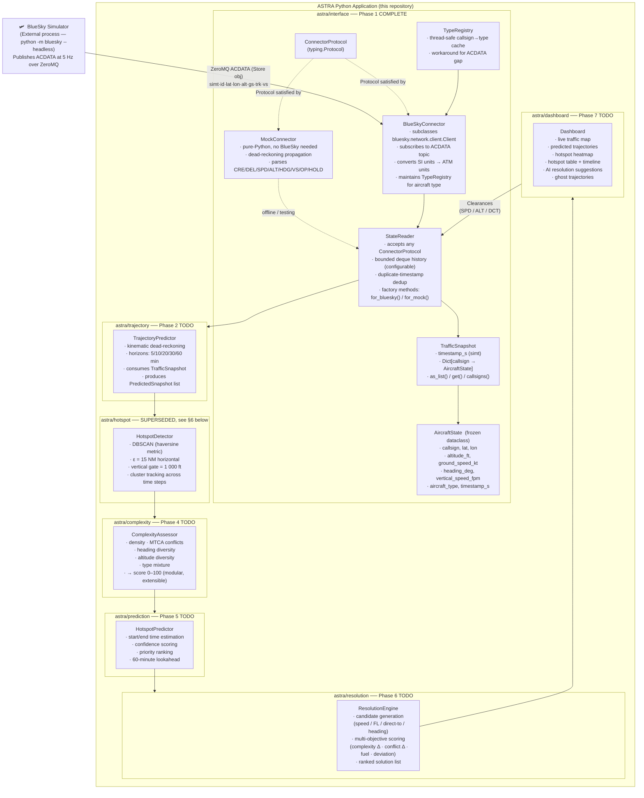
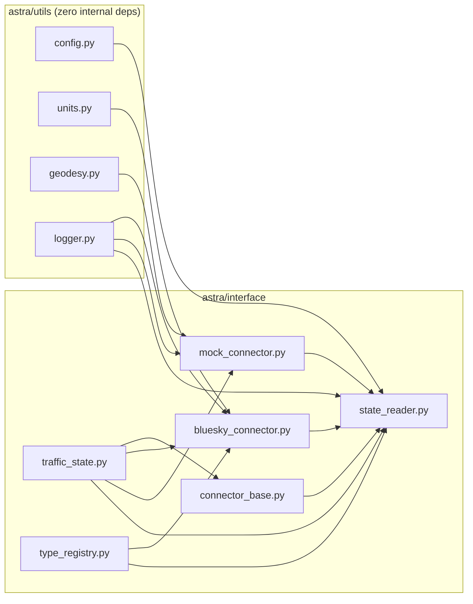
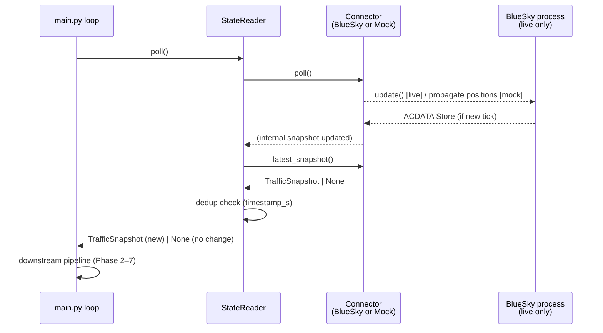
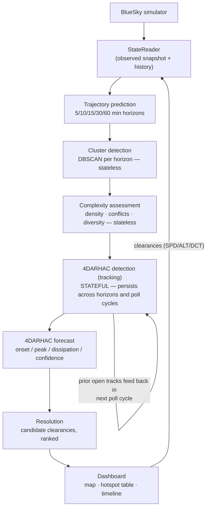

# ASTRA Prototype — System Architecture

## 1. High-Level Data Flow



---

## 2. Package Dependency Graph



Rules enforced in CI (V3):
- `utils` never imports from `interface` or any later phase.
- `bluesky` is imported **only** in `bluesky_connector.py`.
- No circular imports (verified by DFS).

---

## 3. Poll-Cycle Sequence



---

## 4. ConnectorProtocol

Both concrete connectors satisfy this Protocol via **structural subtyping**
(no explicit inheritance — avoids MRO collision with BlueSky's `Client`):

```
ConnectorProtocol
├── connect()                     → None
├── poll()                        → None
├── latest_snapshot()             → Optional[TrafficSnapshot]
├── has_active_node()             → bool
├── send_command(text: str)       → None
└── create_aircraft(cs,type,lat,lon,hdg,alt,spd) → None
```

---

## 5. Unit Conventions

| Domain       | Unit used throughout ASTRA | BlueSky internal | Conversion |
|---|---|---|---|
| Altitude     | feet (ft)                  | metres (m)       | `meters_to_feet()` |
| Ground speed | knots (kt)                 | m/s              | `mps_to_knots()` |
| Vertical speed | feet/minute (fpm)        | m/s              | `mps_to_fpm()` |
| Distance     | nautical miles (NM)        | metres (m)       | `nm_to_meters()` |
| Heading      | degrees true               | degrees true     | (unchanged) |
| Position     | decimal degrees WGS-84     | decimal degrees  | (unchanged) |
| Time         | simulation seconds (simt)  | simulation seconds | (unchanged) |

All conversions happen **once**, at the `_on_acdata()` boundary in
`bluesky_connector.py`. Every module above that layer works exclusively in
ATM units.

---

## 6. 4DARHAC Domain Model and Revised Pipeline (proposed — pending approval)

> **Status:** design decision recorded by the July 2026 architecture review.
> Not yet implemented. Supersedes the single `astra/hotspot` box in §1's
> diagram and the "Phase 3 TODO" framing above. See the review conversation
> for full rationale.

### 6.1 Why the old Phase 3 ("hotspot detection") was under-specified

`astra/hotspot`'s original docstring bundled two operations that have
different natures under one component:

- **Spatial clustering** (DBSCAN over one snapshot) — stateless, pure.
- **Temporal linkage** ("is this cluster the same physical area I saw at
  the last horizon, or the last poll cycle?") — stateful, an association/
  tracking problem, with no owner anywhere in the original design despite
  being name-checked as a bullet ("cluster tracking across time steps").

A 4D Area of Relatively High ATC Complexity (4DARHAC) is, by definition, a
region that persists and evolves through time — not an independent 3D
snapshot recomputed from scratch every horizon and every poll cycle. The
model below makes the identity/tracking problem an explicit, first-class
component instead of an implicit assumption.

### 6.2 Domain model

```python
@dataclass(frozen=True)
class Cluster:
    """Purely spatial grouping at one instant. Stateless, ephemeral —
    identity is only meaningful within a single detection pass."""
    cluster_id: str                  # ephemeral, e.g. f"{horizon_min}:{dbscan_label}"
    source: Literal["observed", "predicted"]
    horizon_min: int                 # 0 = observed/current, else 5/10/15/30/60
    valid_at_s: float                 # ABSOLUTE sim time (timestamp_s + horizon_min*60)
    member_callsigns: FrozenSet[str]
    centroid: tuple[float, float, float]    # lat, lon, alt_ft
    horizontal_extent_nm: float       # or convex hull, for overlap testing


@dataclass(frozen=True)
class ComplexityRegion:
    """A Cluster plus its instantaneous complexity assessment.
    Still stateless / per-instant — composition, not inheritance."""
    cluster: Cluster
    complexity_score: float           # 0-100
    components: dict[str, float]      # density, mtca_count, heading_div, alt_div, type_mix
    computed_at_s: float


@dataclass
class FourDArhac:
    """The persistent 4D object. Mutable / stateful — survives across
    horizons AND across poll cycles."""
    arhac_id: str                     # stable UUID, assigned at first detection
    status: Literal["CANDIDATE", "CONFIRMED", "GROWING",
                     "PEAK", "DISSIPATING", "CLOSED"]
    track: list[ComplexityRegion]     # ordered by valid_at_s
    member_aircraft: FrozenSet[str]   # union of callsigns across the track
    first_detected_cycle_s: float
    predicted_onset_s: float | None
    peak_complexity: float
    peak_time_s: float | None
    predicted_dissipation_s: float | None
    confidence: float                 # 0-1, can strengthen across repeated cycles
    priority: int                     # FMP triage ranking
    last_updated_cycle_s: float       # for closing stale tracks not re-observed
```

**Proposed tracking heuristic:** primary match signal is Jaccard similarity
of `member_callsigns` between a new `Cluster` and the most recent
`ComplexityRegion` on each open `FourDArhac` track, with centroid/extent
overlap as a fallback for longer-horizon predictions where membership
drifts. Callsign overlap is cheap, robust to prediction error, and directly
meaningful.

### 6.3 Revised milestone breakdown

| # | Milestone | Nature | Depends on |
|---|---|---|---|
| 3 | Cluster detection | pure / stateless | Trajectory prediction (Phase 2) |
| 4 | Complexity assessment | pure / stateless | Cluster detection |
| 5 | 4DARHAC detection (tracking) | **stateful** | Cluster detection (+ complexity, to carry scores onto tracks) |
| 6 | 4DARHAC forecast | stateful, layered on 5 | 4DARHAC detection |
| 7 | Resolution | stateless given a 4DARHAC | 4DARHAC forecast |
| 8 | Dashboard | presentation | everything above |

### 6.4 Revised data flow



Note the self-loop on `4DARHAC detection`: unlike every other stage, it is
not a pure function of its immediate input — it must be seeded each poll
cycle with the set of currently-open `FourDArhac` tracks from the previous
cycle, which is the mechanism that gives an ARHAC a stable identity over
wall-clock time rather than being rediscovered from scratch every second.
